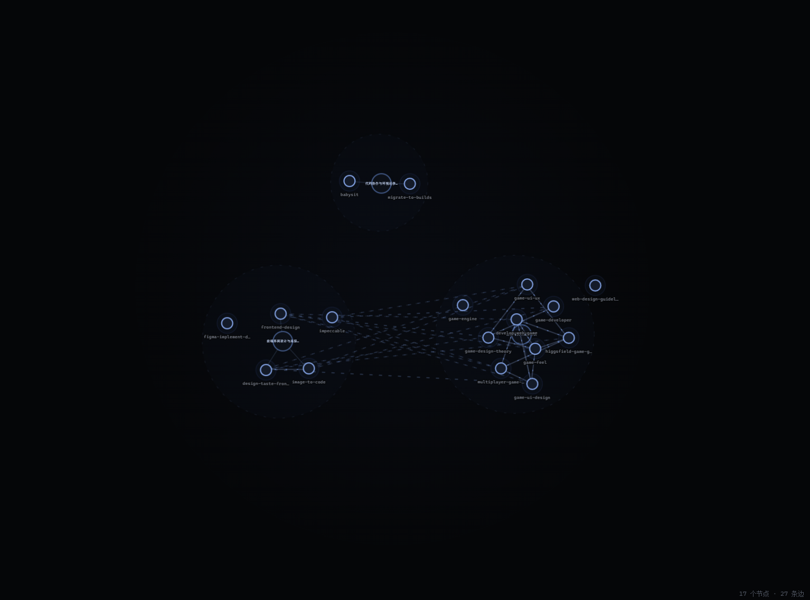
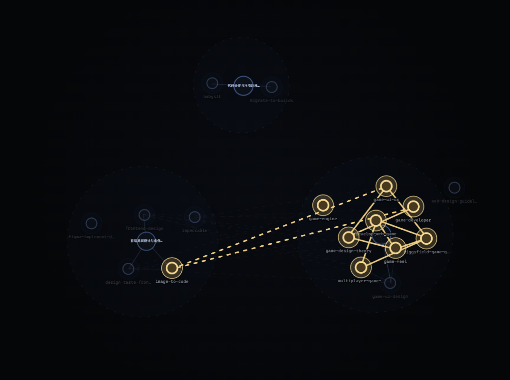

  

<h1 align="center">Deadalus Skills Manager</h1>

把分散的 Skills 整理成看得懂、找得到、能按项目使用的能力库。

V1.0.0 · Windows x64 / macOS（Apple Silicon 与 Intel）· 中文 / English

## Deadalus 是什么？

Deadalus 是一个面向 Claude Code、Codex 和 Cursor 用户的 Skills 管理应用。

Deadalus 的工作是提供一个更为便捷的平台和方式来展示你所拥有的skills，并高度自动化的为你灵活应用。包含以下功能

- **集中查看**：把本机识别到的 Skills 汇集起来，查看名称、概述和安装情况。
- **可视化理解**：用节点、集群和连线展示 Skills 的功能分布与联系。
- **按用途整理**：创建自己的类别，保存一套可以反复使用的 Skills 组合。
- **按项目配置**：为指定项目准备专用 Skills，不必每次修改全局配置。
- **按需求挑选**：描述想完成的工作，让整理助手在指定范围内寻找合适的 Skills。
- **管理安装**：复制、卸载、暂时禁用和恢复 Skills。

## 下载和开始使用

在 [GitHub Releases](https://github.com/aawang1/deadalus-skills-manager/releases) 的附件区（Assets）选择与你的系统对应的发布压缩包。

### Windows

下载 `Deadalus-1.0.0-windows-x64.zip`，解压后运行其中的安装程序，按照提示安装。

应用需要 WebView2；电脑尚未安装时，安装程序可能需要联网补充运行环境。当前安装包未签名，可能出现未知发布者提示，请确认下载来源，不要因此关闭系统安全防护。

### macOS

macOS 发布包名为 `Deadalus-1.0.0-macos-universal.zip`，适用于 macOS 12 及以上版本，同时包含 Apple Silicon（M 系列）和 Intel 支持，不需要分别选择芯片版本。若附件区尚未出现该文件，请等待 macOS 包上传。

1. 下载并解压压缩包。
2. 打开其中的 `.dmg` 文件。
3. 将 Deadalus 拖入 **Applications（应用程序）**。
4. 从应用程序目录打开 Deadalus。

当前 macOS 包尚未经过 Apple 开发者签名与公证，系统可能阻止首次打开。请先核对下载来源，再根据 macOS“系统设置 → 隐私与安全性”中的提示处理；不要关闭系统安全防护。此版本已完成打包校验，但尚未完成真实 Mac 上的完整人工使用测试。

压缩包中的 `SHA256SUMS.txt` 用于核对文件完整性，`THIRD-PARTY-NOTICES.txt` 是第三方组件许可说明，都不是需要运行的程序。

第一次使用，可以先浏览左侧“所有 Skills”和各个 Agent 的列表。需要生成关系图或使用自动整理时，再按照本文末尾的“配置与后续更新”完成设置。

## 基础说明

### 1. 所有 Skills：你的统一后备库

“所有 Skills”是集中浏览和管理能力的入口。Deadalus 会将识别到的 Skills 自动备份到应用管理的本地库 `all_skills` 中，便于后续整理和复制。

可以把它理解成一个书架：书放在书架上，不代表每个项目都正在使用它。

因此：

- 出现在“所有 Skills”中，不代表已经安装给所有 Agent。
- 某个 Agent 卸载了一个 Skill，不代表后备库中的副本也会删除。
- 你可以从库中挑选 Skills，复制到需要的 Agent 或项目。
- 库来自你自己的安装与整理，不是预先附带的开发者私人 Skills 集合。

### 2. Agent 全局：某个编程工具的全局 Skills

左侧“Agent 全局”下有 Claude Code、Codex 和 Cursor。这里表示的是这些工具的全局 Skills 安装情况。

如果你希望某项能力可用于某个 Agent 的日常工作，可以将它复制到这个 Agent 中；如果不再需要，可以卸载，或先暂时禁用。

这里的操作可能改变真实安装目录，不只是修改 Deadalus 中的显示。某些目录会被多个 Agent 共同读取，操作前应留意共享目录警告。

### 3. 自定义类别：你自己保存的能力组合

自定义类别是你给 Skills 建立的分组，例如：

- “网页界面优化”：收集设计、交互和前端相关 Skills。
- “资料整理”：收集文档提取、清洗和归档相关 Skills。
- “新项目启动包”：保存每次开始项目都会用到的一组能力。

一个 Skill 可以加入多个自定义类别。类别主要记录“这组包含哪些 Skills”，不是为每个类别重复安装一份。

**创建类别不等于安装，删除类别也不等于卸载。**它更像一份可重复使用的能力清单；需要实际使用时，再把这组 Skills 复制到 Agent 或项目。

### 4. 项目类别：绑定一个真实项目的专用配置

项目类别与一个项目根目录绑定，用来查看和管理这个项目的专用 Skills。

例如，你有一个网站项目和一个游戏项目，可以分别为它们准备不同的 Skills，而不用把所有能力都放进同一个全局安装位置。

向项目复制 Skills 时，应用会在项目内部署供 Codex、Cursor 使用的共享目录，并为 Claude Code 保存对应副本。后续应在对应项目中使用这些编程工具。

项目专用配置并不意味着全局 Skills 自动停用；实际可用范围仍受到对应 Agent 的加载规则影响。

### 5. 图中的集群：自动归纳的功能分组

关系图会把功能相近的 Skills 聚集起来，并在集群中心显示名称。

**集群和自定义类别不是一回事：**

- 自定义类别由你创建，用来保存和部署一组 Skills。
- 集群由应用根据能力内容归纳，用来帮助你理解当前这组 Skills。

一个“网页项目”自定义类别，在图中仍可能包含设计、数据处理、交付协作等多个集群。图中的集群不会自动变成左侧的新类别。

### 6. 自动整理 Skills Agent：帮你挑选能力的助手

右侧的栏位是 Deadalus 内部的整理助手，和左侧 Claude Code、Codex、Cursor 的安装类别不同。

它的工作是理解你想做什么，从绑定的类别中挑输入的需求，需要的能力和目标的项目与功能，选择 Skills，并让你将结果保存为新类别或复制到其他目标。

## 界面

应用的主要区域从左到右是：

- **左侧导航**：选择所有 Skills、Agent 全局、自定义类别或项目。
- **Skills 列表**：查看当前类别的成员，搜索、展开详情以及管理 Skills。
- **中间关系图**：观察当前类别的能力分布和联系。
- **右侧整理助手**：按任务寻找和整理 Skills。

左上角带蓝色光泽的 **D** 按钮打开设置

“Agent 全局”“自定义类别”“项目”分组可以展开和收起。

选中类别后，Skills 列表右上角的 **向左箭头** 可以将列表收成窄条，让关系图获得更多空间。类别仍保持选中；点击 **向右箭头** 恢复列表。

## 功能一：浏览和管理自己的 Skills

### 查找与阅读

选择“所有 Skills”可以集中查找能力；选择某个 Agent 或类别，则查看相应范围。

提供搜索框的列表支持按名称或描述搜索。“所有 Skills”还可按 Agent 标签筛选。

Skill 卡片上的 **展开** 按钮用于显示完整概述及当前视图提供的详细信息，避免较长内容被截断。再次点击可以收起。

### 复制一个 Skill

“所有 Skills”中的卡片提供复制到 Agent 和复制到类别的入口。

- 复制到 Agent：将能力部署给对应编程工具。
- 复制到自定义类别：将该 Skill 加入这份能力清单。
- 复制到项目类别：在该项目中部署专用 Skills。

若复制失败，应用会显示提示。请根据权限、兼容性或文件问题处理，不要把点击按钮当作已经复制成功。

### 禁用与恢复

Agent 类别中的黄色 **禁用当前** 按钮，用于暂时停用该 Agent 下的 Skill。

禁用后：

- Skill 不会从列表消失，而是变淡并标注禁用。
- 原来的按钮位置会提供绿色解禁按钮。
- 在当前 Agent 的关系图中，节点变淡，不再显示其连线及连线带来的物理互动。

点击绿色按钮可恢复使用。其他类别按照自己的状态显示。

“所有 Skills”是后备库，没有全库禁用功能。

### 卸载与移除

红色按钮的影响取决于你所在的位置，操作前会要求确认：

- **在 Agent 中卸载**：删除对应安装，不只是隐藏列表项。其他 Agent 的独立副本和后备库仍可保留。
- **在自定义类别中移除**：仅从这份清单移除，不卸载其他地方的 Skill。
- **在所有 Skills 中删除**：删除后备副本，并阻止扫描立即将它自动备份回来；不会因此卸载其他 Agent 中的独立安装。需要时再手动重新备份或安装。

如果安装目录由多个 Agent 共享，卸载可能同时影响它们。确认窗口会额外说明，并在可用时提供禁用选项。涉及插件时，也应注意弹窗中的影响范围。

## 功能二：建立自己的 Skills 类别

在左侧“自定义类别”下点击 **新建**：

1. 填写类别名称。
2. 双击一个颜色，作为类别标记。
3. 输入简介，说明这组 Skills 准备用来做什么。
4. 在下方搜索、浏览 Skills，双击卡片选中，再次双击取消。
5. 完成填写和选择后，点击创建。

创建后，类别旁显示对应颜色的小圆点；打开类别时，名称下方会显示简介。

右键类别按钮可选择 **删除**，再次确认后删除类别记录。这个操作不会删除 Skills 文件，也不会卸载已经部署到 Agent 或项目中的内容。

### 把整套组合复制出去

类别顶部提供目标选择和两种复制方式：

**增量复制**只补齐目标缺少的 Skills，保留目标已有的其他内容。

例如，来源有 A、B，目标有 B、C，增量复制后目标有 A、B、C。

**覆盖复制**将目标的受管理 Skills 调整为来源的组合，可能同时新增和删除。

同样的例子中，覆盖后目标变成 A、B，原本额外的 C 会被移除。向 Agent 覆盖时，内置 Skills 保留；涉及共享安装时，还需要处理风险确认。

## 功能三：为项目准备专用 Skills

在“项目”下点击 **新建**：

1. 填写名称、颜色和简介。
2. 点击 **选择项目根目录文件夹**。
3. 选择整个项目所在的根文件夹。
4. 确认创建。

创建后，可以从现有类别或整理助手的结果中，将需要的 Skills 复制到该项目。

项目类别展示项目专用 Skills；其关系图也只展示这个范围内符合显示条件的成员，不会把整个 Agent 的全局安装当作项目内容。

当前部署会使用项目下的 `.agents/skills` 和 `.claude/skills`，分别为支持相应目录的工具提供内容。无需为了不同 Agent 手工建立多个相同的项目类别。

列表中的黄色 **目录交叉** 提示表示目录可能被多个 Agent 共享读取，应谨慎处理删除或覆盖。

**删除项目类别不等于删除项目。**右键删除只移除 Deadalus 中的类别记录，不涉及删除项目文件夹，也不清除已经部署的项目 Skills。

## 功能四：通过关系图理解能力分布

关系图跟随左侧当前选中的类别。

图中各个元素的含义是：

- **普通圆形节点**：一个 Skill。
- **较大的集群中心**：一组功能的名称和支点，不是可以安装的 Skill。
- **集群范围**：表示哪些 Skills 被归为一组。
- **连线**：Skills 之间的关系；一条线可能包含多种关系。
- **外围的独立节点**：尚未归入主要集群的能力。

功能相近的能力通常更靠近，集群内还会体现更细的用途差异。但“靠近”“相连”不等于可以互相替代，也不是已经实际合作完成任务的证明。

### 图上的操作

- **滚轮**：放大或缩小视图。
- **拖拽画布空白处**：平移整个视角，松开后保留当前位置，不再自动回正。切换类别时会重置视角。
- **拖拽 Skill 或集群中心**：移动节点，观察相连节点和集群受力变化。
- **双击 Skill**：通常用于突出与它有关的连线，并打开简介和基本信息；当前有正在调整的助手推荐结果时，则用于加入或取消选中该 Skill，详见下方“手动调整推荐组合”。
- **双击集群中心**：突出该集群，查看其概述。
- **双击连线**：查看具体关系；包含多种关系时，会临时展开为并排的多条线。
- **点击空白区域**：关闭弹窗，退出当前突出显示。

当前节点拖拽只是展示交互，松开后仍会回弹，暂不涉及修改 Skill 的分类、归属或实际安装；这与拖拽空白处后保留视角不同。想保存自己的组合，请创建自定义类别。

关系图需要先完成数据准备。尚未处理完成或处理失败的成员可能不显示。红色状态提示通常需要检查更新任务，禁用成员则以较淡的形式显示。

## 功能五：描述工作，自动挑选 Skills

### 先确定助手可以从哪里挑选

先在左侧选择一个类别，再点击右侧长条的 **新建**，创建整理窗口。

每个助手窗口会绑定创建时选中的类别。以后点击它，左侧和关系图也会切换到对应类别；类别有颜色时，右侧按钮使用相同的颜色标记。

右键右侧的助手按钮，选择 **重命名**，可以给窗口起一个方便辨认的名字，例如“网站界面整理”。名称会保存在本机，重命名不会改变它绑定的类别或已有检索记录。

### 输入需求并发送

打开助手后，点亮输入框左侧的 **新建** 按钮。按钮变成金色，表示进入自动整理状态；再次点击可以关闭。

然后输入希望完成的工作。可以说明目标、数据类型和希望改善的环节。

点击 **发送**、请求被接受后，你的需求会出现在记录区。完成后，同一位置展开推荐结果。失败时则显示错误提示，便于检查后重新尝试。等待期间可以输入下一条草稿，当前任务完成不会清空这份新草稿。

### 使用推荐结果

结果窗口会列出选中的 Skills，可以滚动查看。关系图中的对应节点会亮起，选中成员之间的相关连线也会突出显示。

### 手动调整推荐组合

推荐结果可以直接修改：

- **双击图中已高亮的 Skill**：将它从本次组合中移除。
- **双击图中未高亮的 Skill**：将它加入本次组合，列表中标注“手动加入”。
- **点击结果列表中 Skill 右侧的小叉号**：取消选中该成员，不卸载或删除其文件。

这些操作仅在助手绑定的当前类别范围内进行，图中的高亮与右侧名单同步变化。只有两个端点都被选中的连线才会随结果高亮；自动推荐项不再显示匹配百分比。

### 保存或复制调整后的结果

结果下方提供：

- **创建新类别**：保留这组 Skills，只需补充名称、颜色和简介。
- **增量复制**：选择 Agent、已有自定义类别或项目，添加缺少的成员。
- **全量复制**：将目标受管理的组合替换为这组结果，操作前仔细确认删除影响。

上述操作使用的是你调整后的成员名单，而不是最初的推荐名单。全部取消选中后，需要重新加入成员才能创建或复制。

### 像聊天记录一样查看之前的检索

每个助手窗口有各自的本地检索历史。上下滚动可以查看之前发送的需求和结果；新检索不会覆盖旧检索，关闭后重新打开窗口或重启应用，也会恢复已保存的记录。

点击旧记录中的 **查看并调整这次结果**，可以重新激活那一组结果，在图中查看高亮、增删成员，再创建类别或复制。一次只有一组结果处于当前调整状态。若某个旧成员已经不存在，历史仍可保留其名称信息，但不会把不存在的 Skill 复制出去。

如果应用在分析中退出，重新打开后会将该次记录标为中断，不会自动重新发起可能产生费用的请求。

结果窗口右上角的红色按钮经确认后删除这一条推荐记录；若它是当前结果，也会清除对应高亮，不卸载 Skills。

右键侧边栏中的助手按钮，可以删除整个助手窗口，需要二次确认。该窗口的历史和草稿也会被清除，但不会删除 Skills 安装、API Key 或其他助手窗口的记录。

推荐是一份待你检查的组合，不是自动执行指令。若结果不合适，可以调整需求描述、检查绑定范围，再重新整理。

## 配置与后续更新

### 通用设置：语言

点击左上角 D，进入 **通用设置 → 语言**，选择中文或 English。

语言会影响界面说明，也会改变 Skills 概述翻译的目标语言。翻译只用于显示，不改写原始 Skill 文件；翻译失败时可能继续显示原文。

### apikeys管理：分别保存两种用途

分析、翻译和自动整理需要配置服务凭据；生成能力地图也需要对应凭据。

在 **apikeys管理** 中选择服务商、输入 Key，并在右侧选择储存用途：

- **Agent**：供内容理解、概述及任务整理使用。
- **Embedding**：供关系图所需的数据准备使用，目前支持 OpenAI、Qwen。

保存后，在对应一栏启用。如果同一个 Key 要承担两种用途，需要分别保存两次；新保存的两份记录独立管理，删除一份不会删除另一份。

API 服务可能单独计费，请确认账户权限和余额，不要把普通聊天订阅当作可直接使用的 API 额度。

### Embedding Profiles：管理不同版本的能力地图数据

创建时填写名称和简单描述即可，不需要手动填写模型细节。

创建后还需要完成构建，才能使用。应用可以保留多份配置，但同一时间只启用一份；查看关系图时使用的是当前活动配置。

卡片右上角的删除按钮需要二次确认。删除的是这份配置及相关数据，不是卸载 Skills；正在使用或仍有任务的配置不能直接删除。

### 索引与同步：让地图跟上 Skills 的变化

第一次使用时，选择目标 Profile，点击 **全量重建**，检查预计耗时和消耗后确认。完成后使用就绪配置查看关系图。

日常新增或修改 Skills 后：

- **扫描变更**：先查看有哪些新增、修改或删除。
- **应用增量**：处理变化内容，尽可能保留未变化部分的已有结果。
- **全量重建**：重新准备整个范围的数据，通常更耗时，适用于需要整体重新生成的情况。

**自动更新**决定是否在变化后自动安排更新。**忽略内置 Skills**用于排除工具自带内容的后续处理。

处理深度滑块从左到右为 **核心、摘要、全量向量、完整**，逐步增加处理内容与深度。将鼠标停在档位上可查看范围说明。更高档不等于每次都必须使用，应结合自己的 Skills 内容、时间和费用选择。

调整档位不会立刻重写已有地图；它会影响随后执行的更新或重建。

下方 **Jobs** 显示任务状态。删除单条历史或清空已结束任务历史，只整理任务记录，不等于删除 Skills 或整份地图数据。

## 一次完整的使用示例

假设你准备开始一个新的数据展示网站：

1. 打开“所有 Skills”，了解当前已经有哪些能力。
2. 在右侧新建一个绑定“所有 Skills”的整理助手。
3. 点亮输入框旁的“新建”，描述网站需要的数据处理、图表和界面工作。
4. 检查推荐结果，在图中查看这些 Skills 的分布与联系；双击节点或点击列表中的小叉号，调整本次组合。
5. 点击“创建新类别”，保存为“数据展示网站工具包”，填写颜色和简介。
6. 在左侧“项目”中新建项目类别，选择网站项目的根目录。
7. 将工具包增量复制到这个项目。
8. 在对应项目中使用 Claude Code、Codex 或 Cursor 开展工作。

以后做类似项目，可以继续使用这份自定义类别，不必从头挑选。只想为某个项目补充少量能力时，增量复制即可；要完全替换原方案时，再使用覆盖复制。

## 常见疑问

### 删除类别会删掉里面所有 Skills 吗？

删除自定义类别只删除类别及成员关系。删除项目类别也只移除应用中的记录。它们都不同于在 Agent 中卸载 Skill。

### 为什么列表里有内容，中间却没有图？

先检查地图构建任务是否完成、是否启用了就绪的 Profile，以及当前类别是否包含可显示的成员。文件已经被发现和地图数据已经准备好，是两件不同的事。

### 为什么整理助手没有找到某个 Skill？

先看助手绑定的是哪个类别。它只能在这个范围内挑选；要扩大范围，应为“所有 Skills”等更大的类别创建助手。也需要检查数据准备状态。

### 能否只管理 Skills，不生成关系图？

可以先浏览和进行本地管理。关系图和依赖其数据的自动整理功能，需要额外完成配置与构建。

### 操作会不会影响真实文件？

复制到 Agent 或项目、卸载、覆盖复制，以及部分禁用操作，会修改安装文件或配置。请认真阅读确认窗口，特别留意共享路径警告。重要内容应另外备份。

## 隐私、费用与反馈

Skills 后备库、类别和相关数据保存在本机，但自动分析、翻译、推荐和地图数据生成会将必要内容发送给你配置的服务商，可能产生费用。“本地管理”不等于所有功能完全离线。

处理私有项目或包含敏感信息的 Skills 前，请确认允许上传相关内容。自动归类和推荐也可能有误，复制和实际使用前应自行检查。

遇到问题可通过 [GitHub Issues](https://github.com/aawang1/deadalus-skills-manager/issues) 反馈，附上应用版本、操作步骤和已脱敏的错误信息。

**不要公开 API Key、个人数据库、私有 Skill 文件或未经脱敏的任务日志。**
